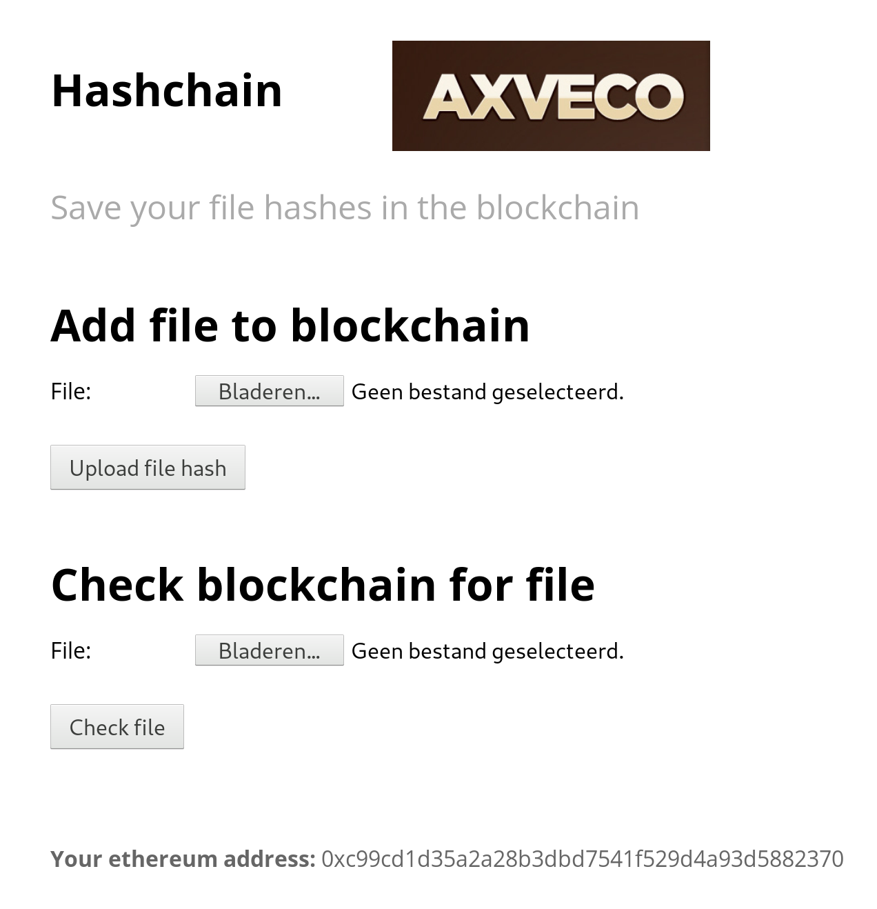

# Hashchain
Hashchain is a web client that saves file hashes on the Ethereum blockchain. 
You can insert files with the web interface and you can also test whether you've already uploaded a file into
the blockchain.

